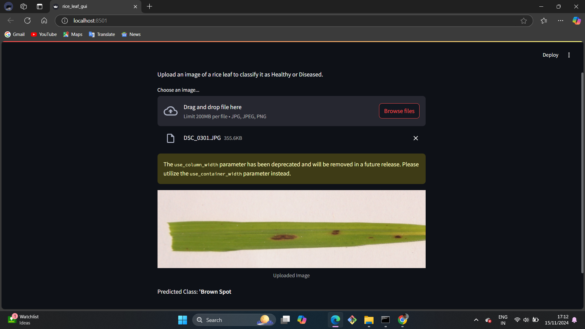
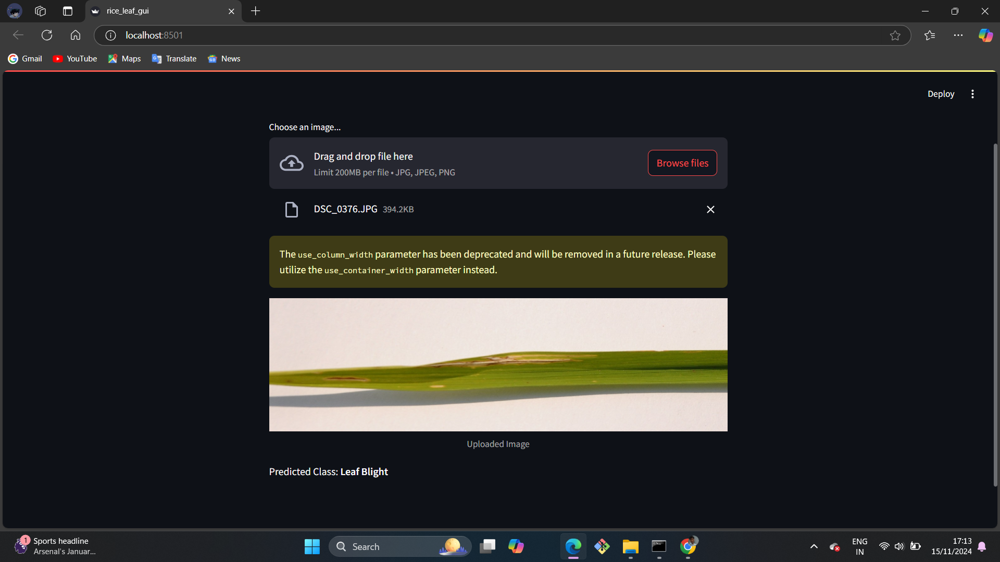

# rice_leaf_pred
# Rice Disease Classifier 🌾
This project is a deep learning-based classifier that identifies diseases in rice leaves. It uses a trained Convolutional Neural Network (CNN) model to predict conditions such as Healthy, Bacterial Blight, or Blast. A user-friendly Streamlit web interface allows users to upload images for predictions.
# Features 🚀
Deep Learning Model: Built using TensorFlow/Keras.
Web Application: Simple, interactive UI built with Streamlit.
Image Classification: Classifies uploaded images into predefined categories.
Scalable: Can be adapted for other plant disease classification tasks.
# Installation 📦
## 1. Clone the Repository
git clone https://github.com/yourusername/rice-disease-classifier.git
cd rice-disease-classifier
## 2. Set Up Environment
Create and activate a virtual environment:
# On Windows
python -m venv streamlit_env
streamlit_env\Scripts\activate

# On macOS/Linux
python3 -m venv streamlit_env
source streamlit_env/bin/activate
### pip install -r requirements.txt
# 3. Add Model File
Ensure your trained model file (rice.h5) is placed in the project directory. If not, retrain the model using the provided Jupyter notebook.#
# Usage 🖥️
## 1. Run the Web App
streamlit run app.py
# Directory Structure 📂
plaintext
Copy code
rice-disease-classifier/
├── app.py                     # Streamlit app script
├── requirements.txt           # Required Python packages
├── rice.h5                    # Pre-trained model file (not included, add your own)
├── rice-disease-classifier.ipynb  # Training notebook
├── README.md                  # Project documentation
└── images/                    # Sample images (optional)

# Requirements 📋
Python 3.8+
TensorFlow/Keras
Streamlit
NumPy
PIL
# Training the Model 🧑‍💻
To retrain the model, open and execute the rice-disease-classifier.ipynb notebook. This will:

Preprocess the dataset.
Train the CNN model.
Save the trained model as rice.h5.

# Demo 🖼️

